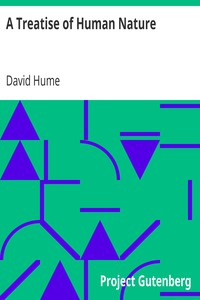

# A Treatise of Human Nature <kbd>v2.3.0</kbd>

## Authors

 - Hume, David <small>(1711 - 1776)</small>

## Translators

## Subjects

 - Knowledge, Theory of

## Readablility

 - **A1:** 72%
 - **A2:** 79%
 - **B1:** 86%
 - **B2:** 93%
 - **C1:** 98%
 - **C2:** 100%

## Words Count

 - **A1:** 472
 - **A2:** 433
 - **B1:** 770
 - **B2:** 1216
 - **C1:** 1391
 - **C2:** 930

## Source

<kbd>GUTHENBURGE:4705</kbd>
