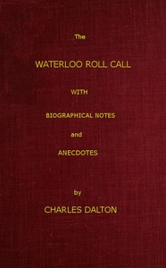

# The Waterloo Roll Call: With Biographical Notes and Anecdotes <kbd>v2.2.1</kbd>

## Authors

 - Dalton, Charles <small>(1850 - 1913)</small>

## Translators

## Subjects

 - Great Britain. Army
 - Waterloo, Battle of, Waterloo, Belgium, 1815

## Readablility

 - **A1:** 77%
 - **A2:** 83%
 - **B1:** 88%
 - **B2:** 93%
 - **C1:** 97%
 - **C2:** 100%

## Words Count

 - **A1:** 482
 - **A2:** 403
 - **B1:** 635
 - **B2:** 864
 - **C1:** 872
 - **C2:** 548

## Source

<kbd>GUTHENBURGE:51143</kbd>
