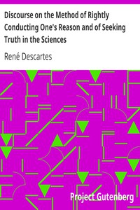

# Discourse on the Method of Rightly Conducting One's Reason and of Seeking Truth in the Sciences <kbd>v2.3.0</kbd>

## Authors

 - Descartes, René <small>(1596 - 1650)</small>

## Translators

 - Veitch, John <small>(1829 - 1894)</small>

## Subjects

 - Methodology
 - Science

## Readablility

 - **A1:** 76%
 - **A2:** 81%
 - **B1:** 88%
 - **B2:** 94%
 - **C1:** 98%
 - **C2:** 100%

## Words Count

 - **A1:** 418
 - **A2:** 316
 - **B1:** 488
 - **B2:** 667
 - **C1:** 559
 - **C2:** 251

## Source

<kbd>GUTHENBURGE:59</kbd>
