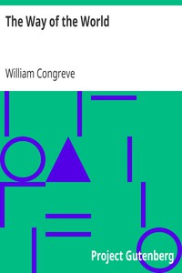

# The Way of the World <kbd>v2.2.1</kbd>

## Authors

 - Congreve, William <small>(1670 - 1729)</small>

## Translators

## Subjects

 - English drama (Comedy)

## Readablility

 - **A1:** 75%
 - **A2:** 80%
 - **B1:** 85%
 - **B2:** 91%
 - **C1:** 97%
 - **C2:** 100%

## Words Count

 - **A1:** 463
 - **A2:** 363
 - **B1:** 547
 - **B2:** 712
 - **C1:** 747
 - **C2:** 475

## Source

<kbd>GUTHENBURGE:1292</kbd>
