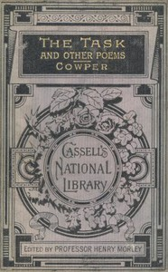

# The Task, and Other Poems <kbd>v2.3.0</kbd>

## Authors

 - Cowper, William <small>(1731 - 1800)</small>

## Translators

## Subjects

 - English poetry

## Readablility

 - **A1:** 68%
 - **A2:** 74%
 - **B1:** 82%
 - **B2:** 89%
 - **C1:** 96%
 - **C2:** 100%

## Words Count

 - **A1:** 479
 - **A2:** 424
 - **B1:** 741
 - **B2:** 1212
 - **C1:** 1535
 - **C2:** 1258

## Source

<kbd>GUTHENBURGE:3698</kbd>
