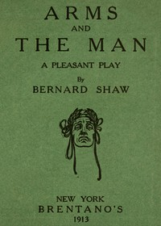

# Arms and the Man <kbd>v2.0.9</kbd>

## Authors

 - Shaw, Bernard <small>(1856 - 1950)</small>

## Translators

## Subjects

 - Bulgaria
 - Italians
 - Love
 - Man-woman relationships
 - Serbo-Bulgarian War, 1885
 - Soldiers
 - War

## Readablility

 - **A1:** 67%
 - **A2:** 73%
 - **B1:** 78%
 - **B2:** 84%
 - **C1:** 85%
 - **C2:** 100%

## Words Count

 - **A1:** 692
 - **A2:** 449
 - **B1:** 573
 - **B2:** 629
 - **C1:** 221
 - **C2:** 1556

## Source

<kbd>GUTHENBURGE:3618</kbd>
