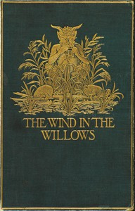

# The Wind in the Willows <kbd>v2.0.2</kbd>

## Authors

 - Grahame, Kenneth <small>(1859 - 1932)</small>

## Translators

## Subjects

 - Animals
 - Country life
 - England
 - Fantasy fiction
 - Friendship
 - Humorous stories
 - Pastoral fiction
 - River life

## Readablility

 - **A1:** 52%
 - **A2:** 58%
 - **B1:** 69%
 - **B2:** 83%
 - **C1:** 87%
 - **C2:** 100%

## Words Count

 - **A1:** 551
 - **A2:** 493
 - **B1:** 818
 - **B2:** 1253
 - **C1:** 556
 - **C2:** 3277

## Source

<kbd>GUTHENBURGE:289</kbd>
