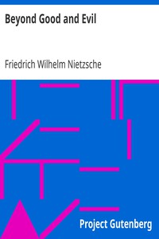

# Beyond Good and Evil <kbd>GUTHENBURGE</kbd>

## Authors

 - Nietzsche, Friedrich Wilhelm <small>(1844 - 1900)</small>

## Translators

 - Zimmern, Helen <small>(1846 - 1934)</small>

## Subjects

 - Ethics
 - Philosophy, German

## Readablility

 - **A1:** 50%
 - **A2:** 57%
 - **B1:** 68%
 - **B2:** 82%
 - **C1:** 87%
 - **C2:** 100%

## Words Count

 - **A1:** 561
 - **A2:** 510
 - **B1:** 821
 - **B2:** 1373
 - **C1:** 542
 - **C2:** 4299

## Tagger Version

v2.0.0
