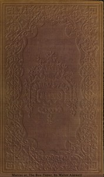

# Marcus; or, The Boy-Tamer <kbd>v2.2.1</kbd>

## Authors

 - Aimwell, Walter <small>(1822 - 1859)</small>

## Translators

## Subjects

 - Brothers
 - Children
 - Farm life
 - Foster children
 - Laziness
 - Schools
 - Students

## Readablility

 - **A1:** 75%
 - **A2:** 82%
 - **B1:** 88%
 - **B2:** 94%
 - **C1:** 98%
 - **C2:** 100%

## Words Count

 - **A1:** 494
 - **A2:** 476
 - **B1:** 868
 - **B2:** 1278
 - **C1:** 1319
 - **C2:** 702

## Source

<kbd>GUTHENBURGE:67950</kbd>
