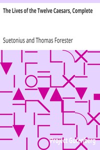

# The Lives of the Twelve Caesars, Complete <kbd>v2.0.2</kbd>

## Authors

 - Suetonius <small>(-1 - -1)</small>

## Translators

 - Thomson, Alexander, M.D. <small>(-1 - -1)</small>

## Subjects

 - Emperors
 - Rome

## Readablility

 - **A1:** 49%
 - **A2:** 55%
 - **B1:** 65%
 - **B2:** 80%
 - **C1:** 83%
 - **C2:** 100%

## Words Count

 - **A1:** 609
 - **A2:** 652
 - **B1:** 1177
 - **B2:** 2003
 - **C1:** 843
 - **C2:** 10732

## Source

<kbd>GUTHENBURGE:6400</kbd>
