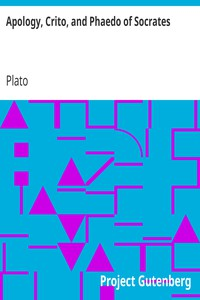

# Apology, Crito, and Phaedo of Socrates <kbd>v2.2.1</kbd>

## Authors

 - Plato <small>(-428 - -348)</small>

## Translators

 - Cary, Henry <small>(1804 - 1870)</small>

## Subjects

 - Socrates, 470 BC-399 BC

## Readablility

 - **A1:** 81%
 - **A2:** 86%
 - **B1:** 91%
 - **B2:** 96%
 - **C1:** 99%
 - **C2:** 100%

## Words Count

 - **A1:** 467
 - **A2:** 367
 - **B1:** 584
 - **B2:** 797
 - **C1:** 746
 - **C2:** 381

## Source

<kbd>GUTHENBURGE:13726</kbd>
