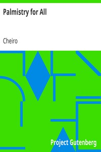

# Palmistry for All <kbd>v2.2.1</kbd>

## Authors

 - Cheiro <small>(1866 - 1936)</small>

## Translators

## Subjects

 - Palmistry

## Readablility

 - **A1:** 73%
 - **A2:** 80%
 - **B1:** 87%
 - **B2:** 93%
 - **C1:** 98%
 - **C2:** 100%

## Words Count

 - **A1:** 456
 - **A2:** 375
 - **B1:** 593
 - **B2:** 766
 - **C1:** 746
 - **C2:** 384

## Source

<kbd>GUTHENBURGE:20480</kbd>
