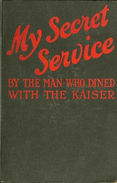

# My Secret Service: Vienna, Sophia, Constantinople, Nish, Belgrade, Asia Minor, etc. <kbd>v2.2.1</kbd>

## Authors

 - Man who dined with the Kaiser <small>(-1 - -1)</small>

## Translators

## Subjects

 - World War, 1914-1918
 - World War, 1914-1918

## Readablility

 - **A1:** 75%
 - **A2:** 81%
 - **B1:** 88%
 - **B2:** 94%
 - **C1:** 98%
 - **C2:** 100%

## Words Count

 - **A1:** 482
 - **A2:** 416
 - **B1:** 717
 - **B2:** 968
 - **C1:** 893
 - **C2:** 458

## Source

<kbd>GUTHENBURGE:67951</kbd>
