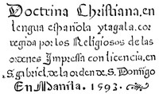

# Doctrina Christiana: The first book printed in the Philippines, Manila, 1593. <kbd>v2.2.1</kbd>

## Authors

## Translators

## Subjects

 - Block books
 - Catholic Church
 - Catholic Church
 - Tagalog language

## Readablility

 - **A1:** 77%
 - **A2:** 82%
 - **B1:** 88%
 - **B2:** 92%
 - **C1:** 96%
 - **C2:** 100%

## Words Count

 - **A1:** 415
 - **A2:** 269
 - **B1:** 415
 - **B2:** 512
 - **C1:** 448
 - **C2:** 328

## Source

<kbd>GUTHENBURGE:16119</kbd>
