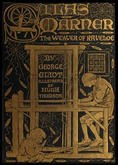

# Silas Marner <kbd>v2.3.0</kbd>

## Authors

 - Eliot, George <small>(1819 - 1880)</small>

## Translators

## Subjects

 - Adopted children
 - Domestic fiction
 - England
 - Fathers and daughters
 - Foundlings
 - Weavers

## Readablility

 - **A1:** 78%
 - **A2:** 84%
 - **B1:** 89%
 - **B2:** 94%
 - **C1:** 98%
 - **C2:** 100%

## Words Count

 - **A1:** 488
 - **A2:** 456
 - **B1:** 829
 - **B2:** 1269
 - **C1:** 1423
 - **C2:** 873

## Source

<kbd>GUTHENBURGE:550</kbd>
