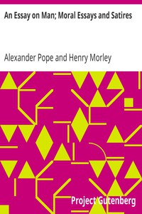

# An Essay on Man; Moral Essays and Satires <kbd>v2.2.1</kbd>

## Authors

 - Pope, Alexander <small>(1688 - 1744)</small>

## Translators

## Subjects

 - English poetry

## Readablility

 - **A1:** 71%
 - **A2:** 77%
 - **B1:** 84%
 - **B2:** 91%
 - **C1:** 97%
 - **C2:** 100%

## Words Count

 - **A1:** 481
 - **A2:** 440
 - **B1:** 745
 - **B2:** 1116
 - **C1:** 1343
 - **C2:** 900

## Source

<kbd>GUTHENBURGE:2428</kbd>
