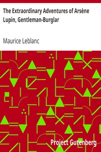

# The Extraordinary Adventures of Arsène Lupin, Gentleman-Burglar <kbd>v2.3.0</kbd>

## Authors

 - Leblanc, Maurice <small>(1864 - 1941)</small>

## Translators

## Subjects

 - Adventure stories, French
 - Burglars
 - Lupin, Arsène (Fictitious character)
 - Mystery and detective stories
 - Short stories

## Readablility

 - **A1:** 74%
 - **A2:** 80%
 - **B1:** 87%
 - **B2:** 93%
 - **C1:** 98%
 - **C2:** 100%

## Words Count

 - **A1:** 484
 - **A2:** 459
 - **B1:** 792
 - **B2:** 1140
 - **C1:** 1182
 - **C2:** 598

## Source

<kbd>GUTHENBURGE:6133</kbd>
