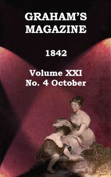

# Graham's Magazine, Vol. XXI, No. 4, October 1842 <kbd>v2.2.1</kbd>

## Authors

 - Various <small>(-1 - -1)</small>

## Translators

## Subjects

 - Literature
 - Literature, Modern

## Readablility

 - **A1:** 72%
 - **A2:** 79%
 - **B1:** 86%
 - **B2:** 92%
 - **C1:** 97%
 - **C2:** 100%

## Words Count

 - **A1:** 494
 - **A2:** 493
 - **B1:** 938
 - **B2:** 1564
 - **C1:** 1971
 - **C2:** 1233

## Source

<kbd>GUTHENBURGE:67995</kbd>
