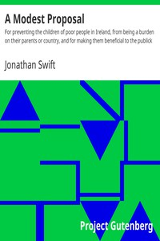

# A Modest Proposal: For preventing the children of poor people in Ireland, from being a burden on their parents or country, and for making them beneficial to the publick <kbd>v2.0.9</kbd>

## Authors

 - Swift, Jonathan <small>(1667 - 1745)</small>

## Translators

## Subjects

 - Ireland
 - Political satire, English
 - Religious satire, English

## Readablility

 - **A1:** 64%
 - **A2:** 71%
 - **B1:** 79%
 - **B2:** 87%
 - **C1:** 88%
 - **C2:** 100%

## Words Count

 - **A1:** 415
 - **A2:** 191
 - **B1:** 250
 - **B2:** 241
 - **C1:** 60
 - **C2:** 430

## Source

<kbd>GUTHENBURGE:1080</kbd>
