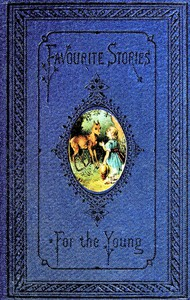

# The power of kindness and other stories: A book for the example and encouragement of the young <kbd>v2.2.1</kbd>

## Authors

 - Arthur, T. S. (Timothy Shay) <small>(1809 - 1885)</small>

## Translators

## Subjects

 - Animal welfare
 - Children's stories
 - Courage
 - Envy
 - Honesty
 - Kindness

## Readablility

 - **A1:** 76%
 - **A2:** 83%
 - **B1:** 90%
 - **B2:** 95%
 - **C1:** 99%
 - **C2:** 100%

## Words Count

 - **A1:** 475
 - **A2:** 377
 - **B1:** 538
 - **B2:** 618
 - **C1:** 479
 - **C2:** 163

## Source

<kbd>GUTHENBURGE:68158</kbd>
