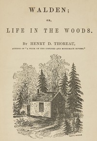

# Walden, and On The Duty Of Civil Disobedience <kbd>v2.0.7</kbd>

## Authors

 - Thoreau, Henry David <small>(1817 - 1862)</small>

## Translators

## Subjects

 - Authors, American
 - Civil disobedience
 - Government, Resistance to
 - Natural history
 - Solitude
 - Thoreau, Henry David, 1817-1862
 - Walden Woods (Mass.)
 - Wilderness areas

## Readablility

 - **A1:** 69%
 - **A2:** 75%
 - **B1:** 81%
 - **B2:** 88%
 - **C1:** 89%
 - **C2:** 100%

## Words Count

 - **A1:** 902
 - **A2:** 716
 - **B1:** 1227
 - **B2:** 1689
 - **C1:** 614
 - **C2:** 6202

## Source

<kbd>GUTHENBURGE:205</kbd>
