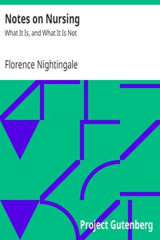

# Notes on Nursing: What It Is, and What It Is Not <kbd>v2.2.1</kbd>

## Authors

 - Nightingale, Florence <small>(1820 - 1910)</small>

## Translators

## Subjects

 - Nursing

## Readablility

 - **A1:** 75%
 - **A2:** 81%
 - **B1:** 88%
 - **B2:** 94%
 - **C1:** 98%
 - **C2:** 100%

## Words Count

 - **A1:** 483
 - **A2:** 416
 - **B1:** 645
 - **B2:** 880
 - **C1:** 903
 - **C2:** 537

## Source

<kbd>GUTHENBURGE:17366</kbd>
