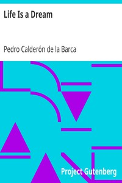

# Life Is a Dream <kbd>v2.3.0</kbd>

## Authors

 - Calderón de la Barca, Pedro <small>(1600 - 1681)</small>

## Translators

 - FitzGerald, Edward <small>(1809 - 1883)</small>

## Subjects

 - Drama

## Readablility

 - **A1:** 74%
 - **A2:** 79%
 - **B1:** 86%
 - **B2:** 92%
 - **C1:** 97%
 - **C2:** 100%

## Words Count

 - **A1:** 448
 - **A2:** 331
 - **B1:** 500
 - **B2:** 637
 - **C1:** 603
 - **C2:** 353

## Source

<kbd>GUTHENBURGE:2587</kbd>
