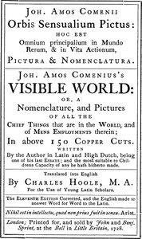

# The Orbis Pictus <kbd>v2.0.2</kbd>

## Authors

 - Comenius, Johann Amos <small>(1592 - 1670)</small>

## Translators

 - Hoole, Charles <small>(1610 - 1667)</small>

## Subjects

 - Latin language
 - Natural history
 - Picture books for children

## Readablility

 - **A1:** 36%
 - **A2:** 41%
 - **B1:** 49%
 - **B2:** 60%
 - **C1:** 63%
 - **C2:** 100%

## Words Count

 - **A1:** 445
 - **A2:** 375
 - **B1:** 603
 - **B2:** 900
 - **C1:** 371
 - **C2:** 8087

## Source

<kbd>GUTHENBURGE:28299</kbd>
