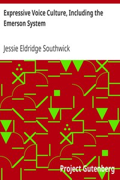

# Expressive Voice Culture, Including the Emerson System <kbd>v2.2.1</kbd>

## Authors

 - Southwick, Jessie Eldridge <small>(1865 - 1957)</small>

## Translators

## Subjects

 - Voice

## Readablility

 - **A1:** 68%
 - **A2:** 75%
 - **B1:** 83%
 - **B2:** 91%
 - **C1:** 97%
 - **C2:** 100%

## Words Count

 - **A1:** 350
 - **A2:** 226
 - **B1:** 334
 - **B2:** 408
 - **C1:** 364
 - **C2:** 193

## Source

<kbd>GUTHENBURGE:7804</kbd>
