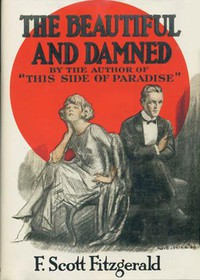

# The Beautiful and Damned <kbd>v2.3.0</kbd>

## Authors

 - Fitzgerald, F. Scott (Francis Scott) <small>(1896 - 1940)</small>

## Translators

## Subjects

 - Alcoholics
 - Domestic fiction
 - Inheritance and succession
 - Married people
 - New York (N.Y.)
 - Psychological fiction
 - Socialites
 - Young men

## Readablility

 - **A1:** 75%
 - **A2:** 81%
 - **B1:** 87%
 - **B2:** 92%
 - **C1:** 97%
 - **C2:** 100%

## Words Count

 - **A1:** 489
 - **A2:** 489
 - **B1:** 927
 - **B2:** 1573
 - **C1:** 2100
 - **C2:** 1932

## Source

<kbd>GUTHENBURGE:9830</kbd>
