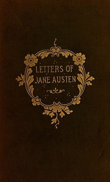

# The Letters of Jane Austen: Selected from the compilation of her great nephew, Edward, Lord Bradbourne <kbd>v2.3.0</kbd>

## Authors

 - Austen, Jane <small>(1775 - 1817)</small>

## Translators

## Subjects

 - Austen, Cassandra, 1773-1845
 - Austen, Jane, 1775-1817
 - Novelists, English

## Readablility

 - **A1:** 81%
 - **A2:** 86%
 - **B1:** 92%
 - **B2:** 96%
 - **C1:** 99%
 - **C2:** 100%

## Words Count

 - **A1:** 490
 - **A2:** 454
 - **B1:** 781
 - **B2:** 1084
 - **C1:** 1130
 - **C2:** 562

## Source

<kbd>GUTHENBURGE:42078</kbd>
