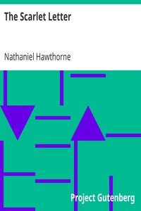

# The Scarlet Letter <kbd>v2.0.9</kbd>

## Authors

 - Hawthorne, Nathaniel <small>(1804 - 1864)</small>

## Translators

## Subjects

 - Adultery
 - Boston (Mass.)
 - Clergy
 - Historical fiction
 - Illegitimate children
 - Married women
 - Psychological fiction
 - Puritans
 - Revenge
 - Triangles (Interpersonal relations)
 - Women immigrants

## Readablility

 - **A1:** 65%
 - **A2:** 71%
 - **B1:** 77%
 - **B2:** 83%
 - **C1:** 85%
 - **C2:** 100%

## Words Count

 - **A1:** 824
 - **A2:** 615
 - **B1:** 958
 - **B2:** 1305
 - **C1:** 504
 - **C2:** 4721

## Source

<kbd>GUTHENBURGE:25344</kbd>
