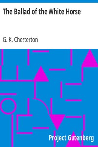

# The Ballad of the White Horse <kbd>v2.2.1</kbd>

## Authors

 - Chesterton, G. K. (Gilbert Keith) <small>(1874 - 1936)</small>

## Translators

## Subjects

 - Alfred, King of England, 849-899
 - Christian poetry
 - Epic poetry
 - Great Britain
 - Historical poetry
 - White Horse, Vale of (England)

## Readablility

 - **A1:** 72%
 - **A2:** 79%
 - **B1:** 86%
 - **B2:** 93%
 - **C1:** 98%
 - **C2:** 100%

## Words Count

 - **A1:** 444
 - **A2:** 304
 - **B1:** 445
 - **B2:** 597
 - **C1:** 568
 - **C2:** 328

## Source

<kbd>GUTHENBURGE:1719</kbd>
