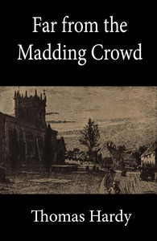

# Far from the Madding Crowd <kbd>v2.3.0</kbd>

## Authors

 - Hardy, Thomas <small>(1840 - 1928)</small>

## Translators

## Subjects

 - Didactic fiction
 - Farm life
 - Love stories
 - Pastoral fiction
 - Triangles (Interpersonal relations)
 - Wessex (England)
 - Women farmers

## Readablility

 - **A1:** 76%
 - **A2:** 82%
 - **B1:** 88%
 - **B2:** 93%
 - **C1:** 98%
 - **C2:** 100%

## Words Count

 - **A1:** 493
 - **A2:** 485
 - **B1:** 938
 - **B2:** 1584
 - **C1:** 2261
 - **C2:** 1854

## Source

<kbd>GUTHENBURGE:107</kbd>
