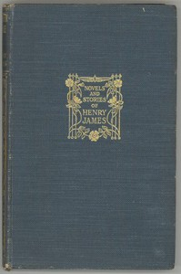

# Washington Square <kbd>v2.2.1</kbd>

## Authors

 - James, Henry <small>(1843 - 1916)</small>

## Translators

## Subjects

 - Domestic fiction
 - Fathers and daughters
 - Love stories
 - Washington Square (New York, N.Y.)
 - Young women

## Readablility

 - **A1:** 80%
 - **A2:** 86%
 - **B1:** 91%
 - **B2:** 95%
 - **C1:** 99%
 - **C2:** 100%

## Words Count

 - **A1:** 483
 - **A2:** 444
 - **B1:** 775
 - **B2:** 1111
 - **C1:** 1171
 - **C2:** 615

## Source

<kbd>GUTHENBURGE:2870</kbd>
