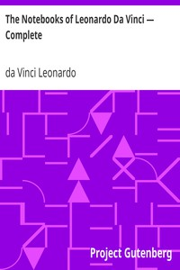

# The Notebooks of Leonardo Da Vinci — Complete <kbd>v2.3.0</kbd>

## Authors

 - Leonardo, da Vinci <small>(1452 - 1519)</small>

## Translators

 - Richter, Jean Paul <small>(1847 - 1937)</small>

## Subjects

 - Leonardo, da Vinci, 1452-1519

## Readablility

 - **A1:** 75%
 - **A2:** 81%
 - **B1:** 87%
 - **B2:** 93%
 - **C1:** 97%
 - **C2:** 100%

## Words Count

 - **A1:** 495
 - **A2:** 478
 - **B1:** 907
 - **B2:** 1530
 - **C1:** 2126
 - **C2:** 1715

## Source

<kbd>GUTHENBURGE:5000</kbd>
