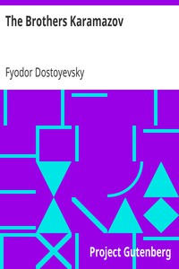

# The Brothers Karamazov <kbd>v2.2.1</kbd>

## Authors

 - Dostoyevsky, Fyodor <small>(1821 - 1881)</small>

## Translators

 - Garnett, Constance <small>(1861 - 1946)</small>

## Subjects

 - Brothers
 - Didactic fiction
 - Fathers and sons
 - Russia

## Readablility

 - **A1:** 80%
 - **A2:** 85%
 - **B1:** 90%
 - **B2:** 95%
 - **C1:** 98%
 - **C2:** 100%

## Words Count

 - **A1:** 494
 - **A2:** 489
 - **B1:** 959
 - **B2:** 1747
 - **C1:** 2497
 - **C2:** 2039

## Source

<kbd>GUTHENBURGE:28054</kbd>
