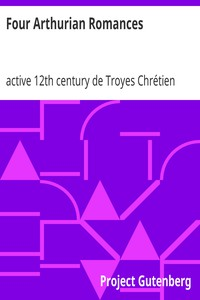

# Four Arthurian Romances <kbd>v2.2.1</kbd>

## Authors

 - Chrétien, de Troyes, active 12th century <small>(-1 - -1)</small>

## Translators

 - Comfort, William Wistar <small>(1874 - 1955)</small>

## Subjects

 - Arthurian romances
 - Chrétien, de Troyes, active 12th century
 - Romances
 - Tales, Medieval

## Readablility

 - **A1:** 78%
 - **A2:** 84%
 - **B1:** 89%
 - **B2:** 95%
 - **C1:** 98%
 - **C2:** 100%

## Words Count

 - **A1:** 493
 - **A2:** 482
 - **B1:** 894
 - **B2:** 1471
 - **C1:** 1808
 - **C2:** 1223

## Source

<kbd>GUTHENBURGE:831</kbd>
