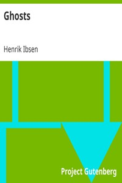

# Ghosts <kbd>v2.3.0</kbd>

## Authors

 - Ibsen, Henrik <small>(1828 - 1906)</small>

## Translators

 - Archer, William <small>(1856 - 1924)</small>

## Subjects

 - Domestic drama
 - Europe
 - Families
 - Mothers and sons
 - Norwegian drama
 - Tragedies

## Readablility

 - **A1:** 80%
 - **A2:** 86%
 - **B1:** 91%
 - **B2:** 95%
 - **C1:** 99%
 - **C2:** 100%

## Words Count

 - **A1:** 472
 - **A2:** 359
 - **B1:** 542
 - **B2:** 651
 - **C1:** 516
 - **C2:** 250

## Source

<kbd>GUTHENBURGE:8121</kbd>
