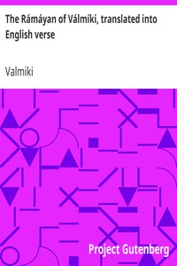

# The Rámáyan of Válmíki, translated into English verse <kbd>v2.0.2</kbd>

## Authors

 - Valmiki <small>(-1 - -1)</small>

## Translators

 - Griffith, Ralph T. H. (Ralph Thomas Hotchkin) <small>(1826 - 1906)</small>

## Subjects

 - Epic poetry, Sanskrit
 - Folklore
 - Rama (Hindu deity)

## Readablility

 - **A1:** 40%
 - **A2:** 46%
 - **B1:** 56%
 - **B2:** 71%
 - **C1:** 75%
 - **C2:** 100%

## Words Count

 - **A1:** 620
 - **A2:** 617
 - **B1:** 1102
 - **B2:** 1888
 - **C1:** 854
 - **C2:** 11923

## Source

<kbd>GUTHENBURGE:24869</kbd>
