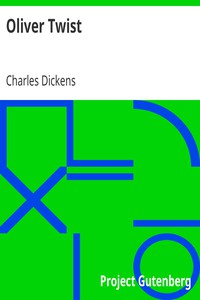

# Oliver Twist <kbd>v2.0.2</kbd>

## Authors

 - Dickens, Charles <small>(1812 - 1870)</small>

## Translators

## Subjects

 - Bildungsromans
 - Boys
 - Criminals
 - Kidnapping victims
 - London (England)
 - Orphans

## Readablility

 - **A1:** 52%
 - **A2:** 59%
 - **B1:** 68%
 - **B2:** 82%
 - **C1:** 86%
 - **C2:** 100%

## Words Count

 - **A1:** 594
 - **A2:** 624
 - **B1:** 1057
 - **B2:** 1750
 - **C1:** 786
 - **C2:** 5879

## Source

<kbd>GUTHENBURGE:730</kbd>
