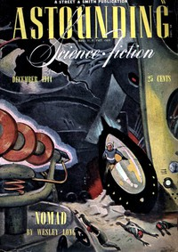

# The Firing Line <kbd>v2.2.1</kbd>

## Authors

 - Smith, George O. (George Oliver) <small>(1911 - 1981)</small>

## Translators

## Subjects

 - Criminals
 - Pirates
 - Science fiction
 - Space stations
 - Weapons

## Readablility

 - **A1:** 73%
 - **A2:** 79%
 - **B1:** 86%
 - **B2:** 92%
 - **C1:** 96%
 - **C2:** 99%

## Words Count

 - **A1:** 428
 - **A2:** 290
 - **B1:** 392
 - **B2:** 484
 - **C1:** 417
 - **C2:** 253

## Source

<kbd>GUTHENBURGE:68001</kbd>
