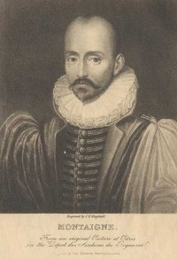

# Essays of Michel de Montaigne — Complete <kbd>GUTHENBURGE</kbd>

## Authors

 - Montaigne, Michel de <small>(1533 - 1592)</small>

## Translators

 - Cotton, Charles <small>(1630 - 1687)</small>

## Subjects

 - French essays

## Readablility

 - **A1:** 51%
 - **A2:** 59%
 - **B1:** 69%
 - **B2:** 82%
 - **C1:** 86%
 - **C2:** 100%

## Words Count

 - **A1:** 664
 - **A2:** 710
 - **B1:** 1327
 - **B2:** 2388
 - **C1:** 1074
 - **C2:** 19858

## Tagger Version

v2.0.0
