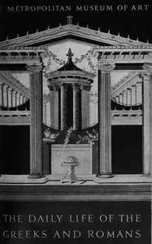

# The daily life of the Greeks and Romans as illustrated in the classical collections <kbd>v2.3.0</kbd>

## Authors

 - Metropolitan Museum of Art (New York, N.Y.) <small>(-1 - -1)</small>
 - McClees, Helen <small>(1885 - -1)</small>

## Translators

## Subjects

 - Art, Greek
 - Art, Roman
 - Greece
 - Rome

## Readablility

 - **A1:** 69%
 - **A2:** 75%
 - **B1:** 83%
 - **B2:** 90%
 - **C1:** 96%
 - **C2:** 100%

## Words Count

 - **A1:** 413
 - **A2:** 321
 - **B1:** 495
 - **B2:** 619
 - **C1:** 633
 - **C2:** 349

## Source

<kbd>GUTHENBURGE:68231</kbd>
