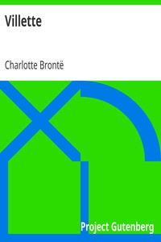

# Villette <kbd>v2.3.0</kbd>

## Authors

 - Brontë, Charlotte <small>(1816 - 1855)</small>

## Translators

## Subjects

 - Autobiographical fiction
 - British
 - Brussels (Belgium)
 - Love stories
 - Women teachers

## Readablility

 - **A1:** 75%
 - **A2:** 81%
 - **B1:** 87%
 - **B2:** 92%
 - **C1:** 97%
 - **C2:** 100%

## Words Count

 - **A1:** 495
 - **A2:** 488
 - **B1:** 966
 - **B2:** 1774
 - **C1:** 2729
 - **C2:** 2499

## Source

<kbd>GUTHENBURGE:9182</kbd>
