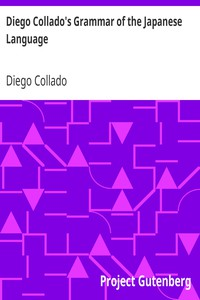

# Diego Collado's Grammar of the Japanese Language <kbd>v2.2.1</kbd>

## Authors

 - Collado, Diego <small>(-1 - 1638)</small>

## Translators

 - Spear, Richard L. <small>(-1 - -1)</small>

## Subjects

 - Japanese language

## Readablility

 - **A1:** 78%
 - **A2:** 83%
 - **B1:** 86%
 - **B2:** 90%
 - **C1:** 95%
 - **C2:** 99%

## Words Count

 - **A1:** 435
 - **A2:** 322
 - **B1:** 436
 - **B2:** 581
 - **C1:** 526
 - **C2:** 380

## Source

<kbd>GUTHENBURGE:21197</kbd>
