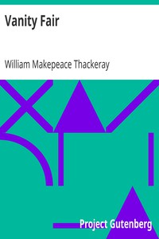

# Vanity Fair <kbd>v2.0.2</kbd>

## Authors

 - Thackeray, William Makepeace <small>(1811 - 1863)</small>

## Translators

## Subjects

 - British
 - England
 - Female friendship
 - Married women
 - Satire
 - Social classes
 - Waterloo, Battle of, Waterloo, Belgium, 1815

## Readablility

 - **A1:** 51%
 - **A2:** 59%
 - **B1:** 68%
 - **B2:** 80%
 - **C1:** 84%
 - **C2:** 100%

## Words Count

 - **A1:** 658
 - **A2:** 674
 - **B1:** 1240
 - **B2:** 2166
 - **C1:** 1002
 - **C2:** 10896

## Source

<kbd>GUTHENBURGE:599</kbd>
