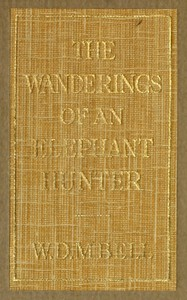

# The Wanderings of an Elephant Hunter <kbd>v2.2.1</kbd>

## Authors

 - Bell, Walter Dalrymple Maitland <small>(1880 - 1954)</small>

## Translators

## Subjects

 - Elephant hunting

## Readablility

 - **A1:** 74%
 - **A2:** 80%
 - **B1:** 87%
 - **B2:** 93%
 - **C1:** 98%
 - **C2:** 100%

## Words Count

 - **A1:** 488
 - **A2:** 459
 - **B1:** 816
 - **B2:** 1196
 - **C1:** 1292
 - **C2:** 853

## Source

<kbd>GUTHENBURGE:68044</kbd>
