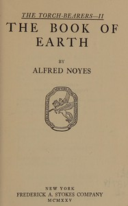

# The book of earth <kbd>v2.3.0</kbd>

## Authors

 - Noyes, Alfred <small>(1880 - 1958)</small>

## Translators

## Subjects

 - Scientists

## Readablility

 - **A1:** 72%
 - **A2:** 78%
 - **B1:** 85%
 - **B2:** 91%
 - **C1:** 97%
 - **C2:** 100%

## Words Count

 - **A1:** 473
 - **A2:** 395
 - **B1:** 640
 - **B2:** 947
 - **C1:** 1098
 - **C2:** 768

## Source

<kbd>GUTHENBURGE:68134</kbd>
