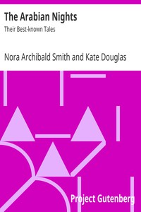

# The Arabian Nights: Their Best-known Tales <kbd>v2.3.0</kbd>

## Authors

## Translators

## Subjects

 - Arabs
 - Fairy tales
 - Fairy tales
 - Folklore
 - Tales

## Readablility

 - **A1:** 77%
 - **A2:** 83%
 - **B1:** 89%
 - **B2:** 95%
 - **C1:** 98%
 - **C2:** 100%

## Words Count

 - **A1:** 493
 - **A2:** 460
 - **B1:** 859
 - **B2:** 1331
 - **C1:** 1451
 - **C2:** 709

## Source

<kbd>GUTHENBURGE:20916</kbd>
