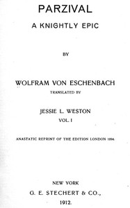

# Parzival: A Knightly Epic (vol. 1 of 2) <kbd>v2.2.1</kbd>

## Authors

 - Wolfram, von Eschenbach, active 12th century <small>(-1 - -1)</small>

## Translators

 - Weston, Jessie L. (Jessie Laidlay) <small>(1850 - 1928)</small>

## Subjects

 - Perceval (Legendary character)

## Readablility

 - **A1:** 74%
 - **A2:** 80%
 - **B1:** 86%
 - **B2:** 93%
 - **C1:** 98%
 - **C2:** 100%

## Words Count

 - **A1:** 481
 - **A2:** 434
 - **B1:** 764
 - **B2:** 1117
 - **C1:** 1269
 - **C2:** 822

## Source

<kbd>GUTHENBURGE:47297</kbd>
