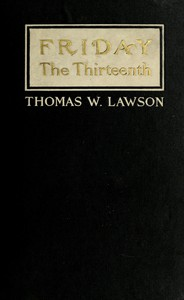

# Friday, the Thirteenth: A Novel <kbd>v2.2.1</kbd>

## Authors

 - Lawson, Thomas William <small>(1857 - 1925)</small>

## Translators

## Subjects

 - Banks and banking, American
 - Banks and banking, International
 - Financial crises
 - National banks (United States)
 - Stock exchanges

## Readablility

 - **A1:** 77%
 - **A2:** 83%
 - **B1:** 89%
 - **B2:** 94%
 - **C1:** 98%
 - **C2:** 100%

## Words Count

 - **A1:** 490
 - **A2:** 445
 - **B1:** 735
 - **B2:** 993
 - **C1:** 1061
 - **C2:** 626

## Source

<kbd>GUTHENBURGE:12345</kbd>
