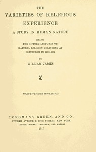

# The Varieties of Religious Experience: A Study in Human Nature <kbd>v2.2.1</kbd>

## Authors

 - James, William <small>(1842 - 1910)</small>

## Translators

## Subjects

 - Conversion
 - Experience (Religion)
 - Philosophy and religion
 - Psychology, Religious
 - Religion

## Readablility

 - **A1:** 74%
 - **A2:** 80%
 - **B1:** 86%
 - **B2:** 92%
 - **C1:** 97%
 - **C2:** 100%

## Words Count

 - **A1:** 495
 - **A2:** 492
 - **B1:** 946
 - **B2:** 1661
 - **C1:** 2410
 - **C2:** 2149

## Source

<kbd>GUTHENBURGE:621</kbd>
