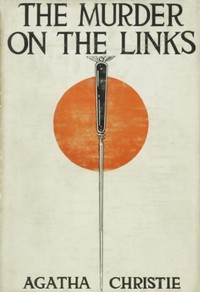

# The Murder on the Links <kbd>v2.3.0</kbd>

## Authors

 - Christie, Agatha <small>(1890 - 1976)</small>

## Translators

## Subjects

 - Detective and mystery stories
 - Poirot, Hercule (Fictitious character)
 - Private investigators

## Readablility

 - **A1:** 78%
 - **A2:** 84%
 - **B1:** 89%
 - **B2:** 94%
 - **C1:** 98%
 - **C2:** 100%

## Words Count

 - **A1:** 487
 - **A2:** 445
 - **B1:** 772
 - **B2:** 1110
 - **C1:** 1175
 - **C2:** 671

## Source

<kbd>GUTHENBURGE:58866</kbd>
